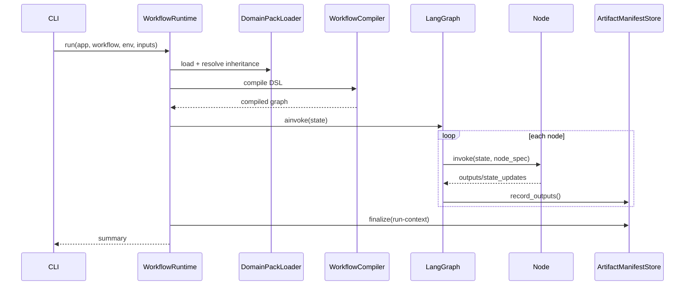
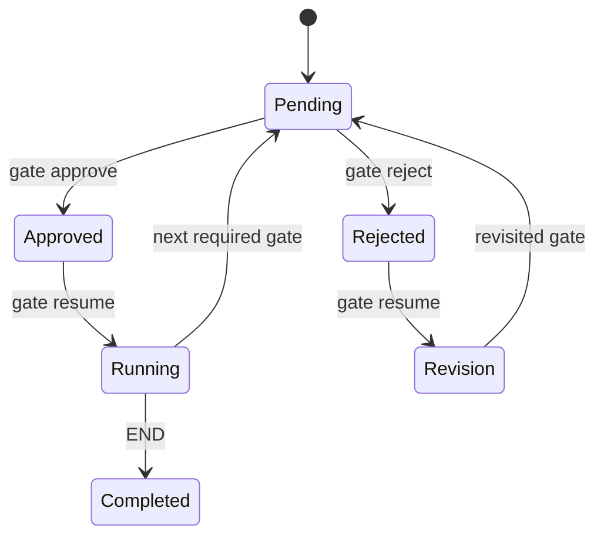

# 通用 E2E 回归框架架构

## 设计原则

- **Core/Domain 分层**：Core 不理解保险、购物车、工作区等行业词，领域知识进入 `domains/*`。
- **Contract First**：跨模块数据使用 `schemas/v2`，运行产物带契约版本与 SHA-256。
- **Workflow First**：测试生命周期由 `workflows/*.yaml` 定义并编译为 LangGraph。
- **Plugin First**：节点、Runner、Assertion、Data Provider 通过稳定接口扩展。
- **Model Agnostic**：LLM 统一经过 `LLMWrapper` 与模型路由配置。
- **Backward Compatible**：1.x 保留 `product-input.json`、四 Agent Graph 和保险 Skill Package。

## 总体结构

```text
App Pack ─────────┐
Domain Pack ──────┼─> WorkflowRuntime ─> WorkflowCompiler ─> LangGraph
Workflow DSL ─────┘           │                    │
                              │                    ├─ Node/Plugin Registry
                              │                    ├─ Gate Runtime
                              │                    └─ Runner Nodes
                              │
                              ├─ Data Resolver / sensitive runtime_data
                              ├─ Assertion Engine
                              ├─ Artifact Manifest Store
                              └─ JSON / HTML / JUnit Reporting
```

## 核心组件

| 组件 | 责任 |
|---|---|
| `ContractRegistry` | Schema 发现、版本标识与校验 |
| `DomainPackLoader` | 领域包继承、Ontology、State Machine、Assertion/Data Pack 合并 |
| `WorkflowCompiler` | DSL 结构校验和 LangGraph 编译 |
| `WorkflowRuntime` | App/Domain/Workflow/Env 装配、执行和恢复 |
| `NodeRegistry` | Agent、Runner、Plugin 实现注册 |
| `ArtifactManifestStore` | 节点输出、Runner 证据、报告和 Run Context 索引 |
| `DataResolver` | fixture、合成数据、API/DB 造数、账号和 Secret 引用 |
| `AssertionEngine` | 领域模板匹配与确定性断言执行 |
| `PluginManager` | Manifest 发现、子进程协议和输入输出 Contract 校验 |
| `Reporting` | JSON、HTML、JUnit 和失败分类 |

## 运行时序



## Gate 状态机



## 配置优先级

```text
defaults < domain config < app config < environment config < runtime overrides
```

有效配置写入 `WorkflowRuntimeState.config`，Secret 原值只允许存在于非持久化 `runtime_data`。

## 扩展边界

- 新领域：新增 `domains/<id>`，可继承 `generic-web`。
- 新工作流：新增 `workflows/<id>.yaml`，无需改 Graph 代码。
- 新 Runner：实现 `ExecutionRunner` 并增加 Runner Manifest/Workflow Node。
- 新插件：运行 `e2e-agent plugin create <id>`。
- 新数据源：实现 Data Provider 并注册到 `DataProviderRegistry`。
- 新断言：在 Domain Assertion Pack 中组合 Operator，复杂规则通过插件扩展。
